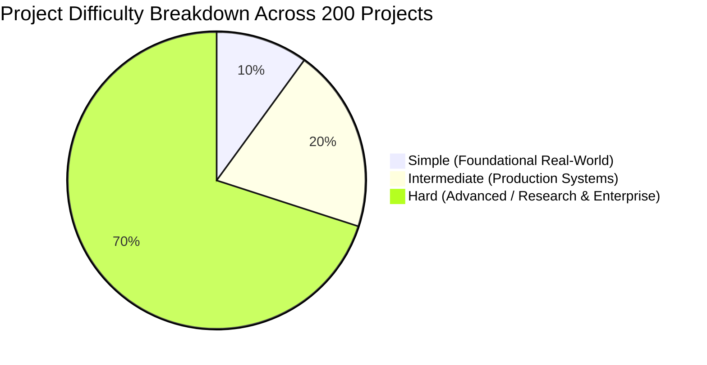

# Comprehensive Master Directory of 200 Industrial-Grade Projects

This catalog contains **200 production-aligned, research-grade, and industry-oriented project blueprints** spread equally across four critical engineering domains:
1. **Cybersecurity & Threat Intelligence** (50 Projects)
2. **Data Science, Artificial Intelligence & Machine Learning** (50 Projects)
3. **Quantum Computing & Quantum Information Systems** (50 Projects)
4. **Processor Architecture, VLSI & Hardware Systems** (50 Projects)

---

### Structure & Difficulty Distribution Per Domain (50 Projects each)
- **Simple (5 Projects)**: Foundational architectures solving real-world niche utility problems.
- **Intermediate (10 Projects)**: End-to-end distributed, high-throughput, or robust specialized systems.
- **Hard / Research & Enterprise Grade (35 Projects)**: Deep-tech, low-level, novel algorithmic, or mission-critical industry systems.

---

# Section 1: Cybersecurity & Threat Engineering (50 Projects)

| Project ID | Project Title | Difficulty | Real-World Problem Statement & Technical Scope | Recommended Tech Stack | Primary Industrial / Enterprise Application |
| :--- | :--- | :--- | :--- | :--- | :--- |
| **CYB-001** | Automated TLS/SSL Cipher Suite & Certificate Drift Auditor | Simple | Continuous monitor verifying edge load balancers, DNS endpoints, and internal microservices against deprecated ciphers (SSLv3, TLS 1.0/1.1) and expiring SAN certs. | Python, `cryptography`, OpenSSL CLI, Prometheus Exporter | Enterprise Infrastructure Security, Compliance Auditing (SOC2/PCI-DSS) |
| **CYB-002** | Ephemeral Honeypot with Low-Interaction SSH Tunnelling | Simple | Lightweight honeynet logging SSH brute-force patterns, password dictionaries, and client fingerprints into an alert pipeline without exposing host kernel resources. | Golang, Docker, SQLite, Telegram/Slack Webhooks | Threat Intelligence Gathering for Mid-market MSPs |
| **CYB-003** | Git Secret Scanner with Custom Regex & Entropy Profiler | Simple | Pre-commit and CI hook detecting high-entropy tokens, AWS/GCP IAM keys, and private SSH keys across shallow/deep git commit histories. | Python/Rust, Git Hook API, Shannon Entropy Engine | DevSecOps Pipeline & Shift-Left Code Governance |
| **CYB-004** | Linux File Integrity Monitor with Auditd & Webhook Alerting | Simple | Daemon hooking into Linux kernel inotify and `auditd` to track write/execute changes in `/etc`, `/usr/bin`, and binary runtimes with tamper-proof hashing. | C/Rust, Linux `inotify`, SHA-256 hashing, Webhooks | Endpoint Integrity for Critical Bare-Metal Servers |
| **CYB-005** | DNS-over-HTTPS (DoH) Outbound Threat Interceptor | Simple | Local DNS proxy parsing DoH lookups, verifying domains against live threat feeds (Spamhaus, URLHaus), and blocking C2 domain queries before resolution. | Golang, DoH RFC 8484 protocol parser, Redis | Branch Office & Small-Office Endpoint Perimeter Defense |
| **CYB-006** | eBPF-Powered Kubernetes Runtime Threat & Privilege Escalation Detector | Intermediate | Non-invasive kernel-level daemon tracking container breakouts, illegal namespace switches, and anomalous system calls (`ptrace`, `setns`) in real-time. | C (eBPF/BCC), Golang, Cilium Tetragon concepts, gRPC | Cloud-Native Security Operations (SecOps), K8s Threat Hunting |
| **CYB-007** | Active Directory BloodHound Graph Differ & Shadow Admin Alert Engine | Intermediate | Graph database analyzer tracking lateral movement risk, ACL drift, unconstrained delegation, and newly spawned Shadow Admin accounts across AD/Entra ID trees. | Python, Neo4j, Cypher Query Language, LDAP/WinAPI | Enterprise Identity Security, Active Directory Blue Teaming |
| **CYB-008** | SBOM (Software Bill of Materials) Continuous Vuln Correlator | Intermediate | Automated ingestion of CycloneDX/SPDX manifests across Docker registries, cross-referencing NVD, OSV, and EPSS scores to alert on vulnerable transitive dependencies. | Python/Go, PostgreSQL, CycloneDX SDK, OSV API | Software Supply Chain Security, SBOM Compliance (Executive Order 14028) |
| **CYB-009** | Cloud Infrastructure Entitlement Management (CIEM) Blast Radius Engine | Intermediate | Graph analyzer parsing AWS IAM / GCP IAM role policies and SCPs to calculate the true reachable privilege blast-radius of compromised service accounts. | Python, AWS IAM Policy Simulator API, NetworkX, FastAPI | Cloud Security Posture Management (CSPM), Multi-Cloud IAM Governance |
| **CYB-010** | Smart Contract Symbolic Execution & Reentrancy Audit Pipeline | Intermediate | Automated AST and bytecode analyzer detecting reentrancy, flash loan exploits, and integer overflow vulnerabilities in EVM Solidity contracts before deployment. | Rust/Python, Slither API, Z3 Theorem Prover, Solidity AST | Web3 Protocol Security, DeFi Smart Contract Assurance |
| **CYB-011** | Zero-Trust Network Microsegmentation Controller for WireGuard | Intermediate | Dynamic identity-aware overlay network assigning ephemeral MTLS and WireGuard peers based on device posture (EDR status, OS patch level) and role ACLs. | Golang, WireGuard Kernel API, SQLite, OAuth2 OIDC | Zero Trust Network Access (ZTNA) for Remote Engineering Teams |
| **CYB-012** | WAF Machine-Learning Ingress Sanitizer for SQLi/XSS/Command Injection | Intermediate | Reverse proxy inspecting HTTP/JSON request payloads with lightweight character-level embeddings and ONNX classifiers to catch zero-day obfuscated payloads. | Rust/Go, ONNX Runtime, libinjection, Redis | API Gateway & Edge Application Layer Defense |
| **CYB-013** | Autonomous Threat Hunting Engine for Windows Event Logs (Sysmon/EVTX) | Intermediate | Scalable streaming parser applying Sigma rules to ingested Sysmon logs, detecting process hollowing, token manipulation, and LSASS dumping. | Python/Rust, Sigma Rule Engine, Apache Kafka, Elasticsearch | SOC Tier-2 Automation, Endpoint Threat Hunting |
| **CYB-014** | CAN-Bus Automotive Intrusion Detection System (IDS) | Intermediate | Embedded vehicle controller scanning Controller Area Network (CAN) frames for injection anomalies, spoofed frame IDs, and denial-of-service bus-flooding. | C++, SocketCAN, Raspberry Pi / CAN Shield, Scikit-Learn | Connected Vehicle & Automotive Telematics Cybersecurity |
| **CYB-015** | Post-Quantum Cryptography (PQC) Hybrid TLS Proxy Gateway | Intermediate | Forward/reverse proxy implementing NIST PQC algorithms (Kyber/ML-KEM, Dilithium/ML-DSA) alongside classical X25519/ECDSA to evaluate migration performance. | C/Rust, OpenSSL 3.x with liboqs, Envoy Proxy Filters | Financial & Government Migration to Quantum-Resilient Networks |
| **CYB-016** | Kernel Hypervisor-Based Rootkit Detector (Type-1/2 Intel VT-x) | Hard | Bare-metal hypervisor leveraging Intel VMX/EPT to inspect guest OS memory pages and detect kernel hooking (IDT, SSDT) without guest OS detection. | C, x86-64 Assembly, Intel VT-x EPT primitives, QEMU/KVM | Low-Level Anti-Cheat, Sovereign State Forensic Sandboxing |
| **CYB-017** | Automated Binary Vulnerability Discovery with Directed Symbolic Execution | Hard | Automated vulnerability triager driving binary binaries to unexplored crash paths using symbolic execution and constraint solvers to find 0-day control-flow hijacks. | C++, LLVM Passes, Angr, Z3 SMT Solver, Capstone | Automated Red Team Tooling, Defense Sector Vulnerability Research |
| **CYB-018** | Industrial Control System (ICS) Modbus/DNP3 Deep Packet Inspector | Hard | Specialized firewall parsing SCADA/ICS protocols to detect unauthorized coil write commands, setpoint deviations, and anomalous PLC state manipulation. | C++, Scapy/DPDK, Wireshark Dissectors, Modbus-TCP Specs | Critical Infrastructure, Smart Grid & Water Treatment Cybersecurity |
| **CYB-019** | Agentless Memory Forensic Scanner for Linux Volatile RAM Dump Analysis | Hard | High-speed memory dump parser extracting bash process history, hidden kernel modules, unlinked process descriptors, and injected shellcode directly from memory snapshots. | Rust, LiME (Linux Memory Extractor), Volatility3 Core Plugin | Digital Forensics and Incident Response (DFIR) Operations |
| **CYB-020** | Hardware-Assisted Control Flow Integrity (CFI) Monitor | Hard | Hardware/software runtime leveraging Intel CET (Shadow Stack) and ARM Pointer Authentication to block ROP (Return-Oriented Programming) chains. | C, Assembly, GDB internals, Linux ptrace, ARM PAC | High-Assurance Defense Systems, Secure Microkernel OS |
| **CYB-021** | Decentralized Identity & Verifiable Credentials Authenticator | Hard | Self-Sovereign Identity (SSI) authentication server utilizing W3C DID standards and Zero-Knowledge Proofs (zk-SNARKs) for privacy-preserving KYC verification. | Rust, Circom, Ethereum/Polygon DID Resolver, WebAuthn | Privacy-Preserving Banking & Fintech Authentication |
| **CYB-022** | EDR Evasion & Behavioral Sandboxing Analysis Framework | Hard | Sandboxed automated detonation chamber evaluating modern malware evasion tactics (sleep-skipping, unhooking ntdll, direct syscalls via Hell's Gate). | C++, Windows Internals, MinHook, YARA Engine, React UI | Advanced Malware Research & Threat Intelligence Labs |
| **CYB-023** | Side-Channel Power Analysis (DPA/CPA) Cryptographic Key Extractor | Hard | Hardware-interfaced platform capturing oscilloscope power traces during AES-128/ECC encryption cycles to compute subkey correlations and extract secrets. | Python, ChipWhisperer SDK, NumPy, C Hardware Driver | Hardware Security Modules (HSM) & Smartcard Certification |
| **CYB-024** | Automated Cloud Lateral Movement & Privilege Escalation Simulator | Hard | Autonomous adversary emulation tool executing MITRE ATT&CK techniques across multi-tenant Kubernetes and AWS clusters to identify unpatched attack vectors. | Golang, AWS SDK, Terraform Core API, Docker API | Continuous Automated Red Teaming (CART), SOC Validation |
| **CYB-025** | Anti-Forensic Resilient Distributed Syslog with Verifiable Hash Chains | Hard | High-throughput distributed append-only logging daemon where every log entry contains a cryptographic aggregate signature (BLS signatures) to prevent tamper. | Rust, Tokio, BLS12-381 Cryptography, RocksDB | Compliance Auditing, Legal Evidence Custody Chains |
| **CYB-026** | LLM Prompt Injection & Data Exfiltration Real-Time Guardrail | Hard | Low-latency inference proxy intercepting prompt injection, indirect context contamination, and PII leakage using fine-tuned transformer tokenizers and rule graphs. | Python/Rust, vLLM, HuggingFace Tokenizers, Redis, ONNX | Enterprise AI Application Security & Copilot Guardrailing |
| **CYB-027** | Firmware Reverse Engineering & Emulation Pipeline for IoT/OT Devices | Hard | Automated pipeline unpacking monolithic firmware images, patching hardware register reads, and emulating target binaries on QEMU for headless AFL++ fuzzing. | Python, Binwalk, Ghidra Headless API, QEMU, AFL++ | IoT Vendor Security Auditing & Medical Device Assurance |
| **CYB-028** | Dynamic Honeynet with Automated Threat Intelligence Extraction (MITRE Tagging) | Hard | Autonomous deceptive environment deploying decoys (fake databases, AD domain controllers) that dynamically converse with attackers and export STIX/TAXII threat feeds. | Golang, Python, Docker Swarm, STIX/TAXII 2.1, Neo4j | Enterprise Deception Technology & Threat Intelligence Sharing |
| **CYB-029** | Continuous Cryptographic Key Lifecycle Management with HSM & MPC | Hard | Distributed key generation (DKG) and signing engine using Multi-Party Computation (Threshold ECDSA) preventing single points of failure in private key storage. | Rust, MPC-CMP Protocol, gRPC, HSM PKCS#11 API | Web3 Institutional Custody, Tier-1 Banking Infrastructure |
| **CYB-030** | Hardware Root-of-Trust (RoT) Remote Attestation Verifier for Edge Nodes | Hard | Remote attestation service verifying TPM 2.0 PCR registers and measured boot logs before provisioning TLS sessions or decryption keys to distributed edge compute nodes. | C/Golang, TPM2-TSS, Linux IMA (Integrity Measurement Architecture) | Defense Telecom, Edge Computing & Critical Infrastructure Security |
| **CYB-031** | Automated Zero-Day Exploit Generation via LLVM-Based Fuzzing & SMT Solving | Hard | Hybrid fuzzer combining LLVM libFuzzer with symbolic taint tracking to automatically generate Proof-of-Concept exploits for memory corruption vulnerabilities. | C++, LLVM Clang Plugin, Z3 SMT, AFL++ Driver | Sovereign Exploit Prevention & Software Vulnerability Research |
| **CYB-032** | 5G Core Network Control Plane Threat Interceptor & Fuzzer | Hard | Specialized network analyzer fuzzing and inspecting 5G NextGen (NGAP, PFCP, HTTP/2 SBI) control plane interfaces for subscriber tracking and denial-of-service flaws. | C/Go, Open5GS, Wireshark Dissectors, Scapy | Telecom Carrier 5G Infrastructure Security Auditing |
| **CYB-033** | Anti-Tamper Software Protection Engine with Control Flow Flattening & OLLVM | Hard | Compiler-level obfuscation framework inserting opaque predicates, instruction substitution, and string encryption into C/C++ binaries to resist IDA/Ghidra reversing. | C++, LLVM Intermediate Representation (IR) Passes | Intellectual Property Protection for Proprietary Client Software |
| **CYB-034** | Autonomous De-Anonymization & Blockchain Transaction Forensics Engine | Hard | High-scale graph intelligence pipeline tracking mixing services (Tornado Cash/Wasabi), peel chains, and cluster addresses across UTXO/Account-based ledgers. | Rust, Apache Spark, GraphX, PostgreSQL, Web3 RPC | Anti-Money Laundering (AML) Compliance & Law Enforcement |
| **CYB-035** | Dynamic Covert Channel Network Exfiltration Detector | Hard | Deep packet anomaly engine analyzing inter-arrival time jitter, TCP ISN encoding, and ICMP payload stealth channels across high-speed edge uplinks. | C++, DPDK (Data Plane Development Kit), Scikit-Learn | Counter-Espionage & Secure Military Network Perimeters |
| **CYB-036** | Automated Ransomware Early-Warning Killswitch via Kernel Minifilters | Hard | Windows Kernel Minifilter Driver monitoring file system I/O entropy spikes, rapid rename sequences, and canary file modification to freeze processes instantly. | C, Windows Driver Kit (WDK), WinDbg, ETW | Anti-Ransomware Endpoint Protection (EDR Modules) |
| **CYB-037** | BGP Route Hijacking & Prefix Anomaly Real-Time Alerting Engine | Hard | Global internet route monitoring engine ingesting live BGP MRT feeds from RIPE NCC and RouteViews to detect prefix hijacking and malicious AS path poisoning. | Python/Rust, BGPstream, Kafka, Redis Timeseries | Tier-1 ISP Core Security, Global Cloud Provider Peering Defense |
| **CYB-038** | Automated Red-Team Command & Control (C2) Traffic Profiler and Classifier | Hard | Network flow classifier dissecting malleable C2 profiles (Cobalt Strike, Mythic, Sliver) using packet size histograms, TLS JA3/JA4 fingerprints, and beacon jitter. | Python, PyTorch, Zeek/Bro, Suricata Plugin | Advanced Network SOC Operations, Threat Intelligence |
| **CYB-039** | Microarchitectural Cache Attack (Spectre/Meltdown/Flush+Reload) Defense | Hard | Linux kernel module and user-space runtime inserting speculative execution barriers and dynamic cache page re-coloring to defeat timing side-channel exfiltration. | C, x86 Assembly, Linux Kernel Architecture, PMU Drivers | Cloud Multi-Tenant Security & Hardware Microarchitecture Safety |
| **CYB-040** | Secure Multi-Party Private Set Intersection (PSI) for Threat Intel Exchange | Hard | Cryptographic protocol enabling competing defense contractors and banks to discover shared IOCs (hashes, IP addresses) without revealing non-shared internal data. | C++, Oblivious Transfer, Paillier Cryptosystem, gRPC | Inter-Bank Fraud Prevention & Threat Intelligence Consortia |
| **CYB-041** | Automated Container Escape Vulnerability Scanner using Linux Cap Matrix | Hard | Scanner evaluating container capabilities (`CAP_SYS_ADMIN`, `CAP_BPF`), misconfigured seccomp profiles, and shared namespaces to construct automatic escape exploits. | Golang, Docker/containerd Engine API, Linux Syscalls | Cloud Security Auditing, DevSecOps Compliance |
| **CYB-042** | UEFI/BIOS Security Validator with SPI Flash Dump & SMM Inspector | Hard | Hardware/firmware analyzer parsing UEFI SPI flash ROM dumps to verify Secure Boot keys, detect DXE driver rootkits, and audit System Management Mode (SMM) handlers. | Python/C, UEFITool Core, Chipsec Framework, QEMU-OVMF | Hardware Supply Chain Verification & Government Hardware Audits |
| **CYB-043** | Android Kernel Binder IPC Fuzzing & Privilege Escalation Framework | Hard | Kernel fuzzer targeting Android Binder IPC drivers and vendor HALs using structured protobuf generation to identify zero-click local privilege escalation paths. | C/C++, Syzkaller, Android NDK, Linux Kernel Tracing | Mobile OS Vulnerability Research & Vendor Security Assessment |
| **CYB-044** | Self-Healing API Gateway with Behavioral Anomaly Isolation | Hard | API reverse proxy modeling per-endpoint OpenAPI traffic distributions and isolating compromised API keys into synthetic mock environments in real time. | Golang, Envoy WASM Filter, Rust, Scikit-Learn | Enterprise SaaS API Security & Account Takeover (ATO) Defense |
| **CYB-045** | Wi-Fi 6 (802.11ax) Protected Management Frame (PMF) Vulnerability Auditor | Hard | RF packet injector and monitor testing WPA3 SAE handshakes, PMF enforcement, and transition mode downgrade exploits against enterprise APs. | C, Linux mac80211 Subsystem, Scapy, Alfa Network Hardware | Enterprise Wireless Infrastructure Security |
| **CYB-046** | High-Throughput Network Traffic Anonymizer with Multi-Hop Garlic Routing | Hard | Custom overlay routing mesh using layered ElGamal encryption and dummy traffic packet shaping to resist global adversary passive traffic correlation attacks. | Rust, Tokio, Curve25519 Cryptography, Raw Sockets | Whistleblower Protection, Sovereign Secure Communications |
| **CYB-047** | Deepfake Video & Voice Biometric Injection Detector for Video KYC | Hard | Streaming video pipeline inspecting facial skin blood-flow photoplethysmography (rPPG) and vocal formant jitter to block deepfakes during biometric onboarding. | Python, PyTorch, OpenCV, WebRTC, MediaPipe | Financial Fraud Prevention, Video Identification Verification |
| **CYB-048** | Automated Ghidra Scripting Pipeline for Mass Malware De-Obfuscation | Hard | Headless Ghidra/IDA cluster analyzing thousands of malware samples daily, extracting encrypted string tables, resolving dynamic API hashes, and exporting rules. | Java, Python (Ghidra API), Ghidra Headless, Celery, MongoDB | High-Throughput Threat Intel Platforms (e.g. VirusTotal Scale) |
| **CYB-049** | Homomorphic Encryption (FHE) Cloud Query Engine for PII Search | Hard | Encrypted database search engine allowing untrusted cloud servers to execute exact and range queries over user PII without ever decrypting the underlying database. | C++, Microsoft SEAL / OpenFHE, Python Bindings | HIPAA/GDPR Healthcare Data Sharing & Sovereign Cloud Analytics |
| **CYB-050** | Zero-Day Browser JavaScript Engine JIT Compiler Fuzzer | Hard | Specialized differential fuzzer mutating ECMAScript ASTs to trigger type confusion and bounds-check elimination bugs in V8 / JavaScriptCore JIT engines. | C++, V8 Internals, Node.js, ClusterFuzz Integration | Browser Security Research & Zero-Day Mitigation |

---

# Section 2: Data Science, AI & Machine Learning (50 Projects)

| Project ID | Project Title | Difficulty | Real-World Problem Statement & Technical Scope | Recommended Tech Stack | Primary Industrial / Enterprise Application |
| :--- | :--- | :--- | :--- | :--- | :--- |
| **AIML-001** | Real-Time Customer Churn Predictor with SHAP Explanations | Simple | Microservice ingesting subscriber billing and telemetry logs, predicting churn probability using XGBoost, and returning SHAP feature attribution values. | Python, XGBoost, SHAP, FastAPI, Docker | Telecom & SaaS Subscription Retention Engines |
| **AIML-002** | Automated Cold-Start Job-Candidate Resume Screening with Sentence Transformers | Simple | Semantic matching engine ranking incoming candidate CVs against structured job postings using dense vector embeddings and skill-overlap filters. | Python, Sentence-Transformers, ChromaDB, Streamlit | HR Tech & Enterprise Talent Acquisition Pipelines |
| **AIML-003** | Micro-Logistics Delivery Route Optimization with OR-Tools | Simple | Constrained vehicle routing solver optimizing 50+ drop-off locations accounting for delivery time-windows, vehicle capacity, and live road distance matrices. | Python, Google OR-Tools, Folium Maps, OpenStreetMap API | Last-Mile E-Commerce & Fleet Dispatch Systems |
| **AIML-004** | Streaming Product Review Sentiment & Aspect Extractor | Simple | Text pipeline parsing Amazon/App Store reviews, extracting key product aspects (battery, screen, UI) and scoring sentiment using lightweight HuggingFace pipelines. | Python, HuggingFace Transformers, Pandas, SQLite | Consumer Market Intelligence & Product Brand Monitoring |
| **AIML-005** | Production Model Performance & Data Drift Monitor | Simple | Automated monitor calculating Kolmogorov-Smirnov statistics, Population Stability Index (PSI), and missingness drift across live production tabular inputs. | Python, Evidently AI, Prometheus, Grafana | MLOps Core Infrastructure & Model Reliability Engineering |
| **AIML-006** | Graph-RAG Engine with Hybrid Dense Retrieval & Neo4j Knowledge Graphs | Intermediate | Retrieval-Augmented Generation system constructing entity knowledge graphs from enterprise PDFs and combining vector similarity with multi-hop graph traversals. | Python, LangChain/LlamaIndex, Neo4j, Qdrant, Ollama/OpenAI | Enterprise Document Intelligence & Technical Support |
| **AIML-007** | Multimodal Medical Report Generator from Chest X-Rays | Intermediate | Vision-Language pipeline accepting DICOM chest radiographs, classifying lung pathologies, and generating draft clinical radiological findings. | Python, PyTorch, TorchXRayVision, BioGPT/Llama-Vision | Clinical Decision Support & Tele-Radiology Assistance |
| **AIML-008** | High-Frequency Order Book Microstructure Alpha Predictor | Intermediate | Temporal transformer model processing Level-2 market depth tick data to forecast short-term mid-price movements and bid-ask spread variations. | Python, Polars, PyTorch, Optuna, TimescaleDB | Quantitative Trading & Market Making Algorithms |
| **AIML-009** | Edge TinyML Vibration Anomaly Detector for Industrial Motors | Intermediate | Quantized 8-bit autoencoder deployed on ARM Cortex-M4 microcontroller detecting bearing failure and acoustic anomalies from 3-axis accelerometer data. | C++, TensorFlow Lite for Microcontrollers, Edge Impulse, C | Industrial IoT Predictive Maintenance (Industry 4.0) |
| **AIML-010** | Multilingual Speech-to-Text & Diarization Pipeline for Contact Centers | Intermediate | Audio intelligence pipeline transcribing dual-channel call center audio, separating speaker turns (agent vs customer), and generating sentiment summaries. | Python, Whisper, PyAnnote Audio, FastAPI, Redis | Call Center QA & Customer Experience Analytics |
| **AIML-011** | End-to-End MLOps Pipeline with Feature Store & Automated Retraining | Intermediate | Continuous training pipeline with Feast feature store, MLflow tracking, automated drift-triggered Airflow DAGs, and Blue/Green model serving. | Python, Feast, MLflow, Apache Airflow, Ray Serve, Kubernetes | Standard Enterprise Production MLOps Platform |
| **AIML-012** | Contrastive Learning Model for Product De-Duplication in Marketplaces | Intermediate | Self-supervised embedding network matching identical e-commerce items despite variations in seller titles, typos, noisy attributes, and varying product images. | Python, PyTorch, SimCLR/MoCo framework, Milvus Vector DB | E-Commerce Catalog Harmonization & Marketplace Search |
| **AIML-013** | Time-Series Hierarchical Energy Demand Forecaster | Intermediate | Probabilistic forecasting engine predicting transformer-level and regional power consumption using DeepAR/Temporal Fusion Transformers with weather inputs. | Python, PyTorch Forecasting, Dask, TimescaleDB | Renewable Energy Scheduling & Power Grid Management |
| **AIML-014** | Autonomous Multi-Agent Research Assistant with Tool Reflection | Intermediate | LangGraph/CrewAI multi-agent coordinator delegating web scraping, code execution, citation cross-checking, and report synthesis with self-correction loops. | Python, LangGraph, DuckDuckGo API, Playwright, FastAPI | Automated Market Research & Technical Intelligence |
| **AIML-015** | Synthetic Tabular Data Generator with Differential Privacy Guarantees | Intermediate | Conditional WGAN-GP / TabDDPM generating high-fidelity synthetic patient/banking records while strictly guaranteeing $(\epsilon, \delta)$-differential privacy. | Python, PyTorch, Diffprivlib, Synthetic Data Vault (SDV) | Privacy-Preserving Banking & Healthcare Data Sharing |
| **AIML-016** | Distributed Speculative Decoding Engine for LLM Inference Serving | Hard | High-throughput serving engine pairing small draft models with large target LLMs using KV-cache sharing and speculative tree verification to double tokens/sec. | C++, CUDA, Python, vLLM Core, TensorRT-LLM | Cloud AI Inference Optimization & Data Center Cost Reduction |
| **AIML-017** | Continuous Reinforcement Learning (PPO) for Data Center Cooling Control | Hard | Closed-loop RL agent interacting with ASHRAE HVAC building simulators to continuously modulate chiller speeds and airflow, reducing Power Usage Effectiveness (PUE). | Python, Gymnasium, Ray RLlib, EnergyPlus Simulator | Hyperscale Green Computing & Sustainable Infrastructure |
| **AIML-018** | End-to-End Autonomous Driving Perception Stack (BEV Fusion) | Hard | Deep network fusing multi-view surround cameras and LiDAR point clouds into a unified Bird's-Eye-View (BEV) representation for 3D bounding box detection. | Python, C++, PyTorch, CUDA, TensorRT, ROS2 | Autonomous Mobility & Robotaxi Perception Systems |
| **AIML-019** | Video Object Segmentation & Inpainting for Automated Media Post-Production | Hard | Zero-shot memory-augmented transformer tracking and segmenting complex occluded objects across 4K 60fps video frames with real-time diffusion inpainting. | Python, PyTorch, SAM-2 (Segment Anything), Diffusers, CUDA | Film Post-Production & VFX Studio Automation |
| **AIML-020** | Molecular Property Prediction & De Novo Drug Molecule Generator | Hard | 3D Equivariant Graph Neural Network (EGNN) and SE(3) diffusion model designing candidate small molecules tailored to bind specific target protein pockets. | Python, PyTorch Geometric, RDKit, OpenMM, BioPython | Computational Chemistry, Pharmaceutical Discovery |
| **AIML-021** | Real-Time Multi-Camera 3D Spatial Tracking & Occupancy Grid Mapping | Hard | Computer vision pipeline fusing calibrated multi-RTSP camera streams to track human 3D trajectories and calculate heatmaps in complex factory layouts. | Python, C++, DeepStream SDK, OpenCV, PyTorch, TensorRT | Smart Retail Layouts & Industrial Shop-Floor Safety |
| **AIML-022** | Self-Supervised Vision Foundation Model for Geospatial Satellite Imagery | Hard | Masked Autoencoder (MAE) trained on multispectral Sentinel/Landsat satellite imagery to classify deforestation, agricultural yields, and disaster flooding. | Python, PyTorch, Rasterio, GDAL, Planetary Computer API | Climate Change Analytics, Agricultural Yield Prediction |
| **AIML-023** | Quantized LoRA (QLoRA) Fine-Tuning & Serving Platform on Consumer GPUs | Hard | Distributed parameter-efficient fine-tuning cluster implementing FlashAttention-3, NF4 quantization, and gradient checkpointing for enterprise domain models. | Python, PyTorch, Unsloth, HuggingFace PEFT, Triton | Private On-Premises LLM Adaptation for Enterprise |
| **AIML-024** | Automated Financial Fraud Detection with Temporal Dynamic Graph Networks | Hard | Dynamic Graph Convolutional Network processing continuous transaction streams to flag syndicated money mule networks and synthetic identity fraud. | Python, PyTorch Geometric, DGL (Deep Graph Library), Kafka | Global Payment Gateways & High-Volume Card Fraud Defense |
| **AIML-025** | Neural Radiance Fields (NeRF) & 3D Gaussian Splatting for Real Estate Digital Twins | Hard | Real-time photorealistic 3D scene reconstruction engine turning unordered smartphone photos/videos into explorable real-time 3D Gaussian splat models. | C++, CUDA, Python, gsplat, PyTorch, WebGL Viewer | Virtual Real Estate Tours & Digital Twin Engineering |
| **AIML-026** | Reinforcement Learning with Human Feedback (RLHF) & DPO Alignment Pipeline | Hard | Full pipeline training reward models, performing Direct Preference Optimization (DPO), and applying rejection sampling to eliminate toxic/hallucinatory LLM behaviors. | Python, PyTorch, HuggingFace TRL, DeepSpeed, Ray | Custom Enterprise LLM Alignment & Safety Engineering |
| **AIML-027** | Low-Latency Neural Speech Synthesis (TTS) with Zero-Shot Voice Cloning | Hard | Diffusion-based acoustic model generating natural expressive speech with 3-second reference audio voice cloning at $<100\text{ms}$ time-to-first-audio latency. | Python, PyTorch, CUDA, Triton Inference Server, FastSpeech | Real-Time Voice Agents, Accessible Tech & Audiobooks |
| **AIML-028** | Real-Time Causal Inference Engine for Algorithmic Pricing | Hard | Double Machine Learning (DML) and DoWhy causal framework estimating heterogeneous treatment effects of discounts while controlling for unobserved confounders. | Python, EconML, DoWhy, Polars, Statsmodels | Ride-Hailing, Airfare & E-Commerce Dynamic Pricing |
| **AIML-029** | Autonomous Code Generation & Test Repair Sandbox Agent | Hard | Autonomous programming agent that executes generated Python/C++ code inside gVisor sandboxes, analyzes stack traces, and self-repairs code iteratively. | Python, Docker/gVisor, Tree-sitter, LangChain, FastAPI | Developer Productivity Tooling (Next-Gen GitHub Copilot) |
| **AIML-030** | Physics-Informed Neural Networks (PINNs) for Aerodynamic Drag Optimization | Hard | Deep surrogate model solving Navier-Stokes partial differential equations to forecast aerodynamic airflow over automotive CAD meshes in milliseconds. | Python, PyTorch, DeepXDE, OpenFOAM, PyVista | Aerospace Design & Automotive Aerodynamic Simulation |
| **AIML-031** | Automated Clinical Trial Cohort Selection from Unstructured Electronic Health Records | Hard | Clinical NLP system parsing millions of physician notes and lab values, resolving SNOMED-CT / ICD-10 ontologies to match oncology patients to clinical trials. | Python, HuggingFace Transformers, SpaCy-MedCat, Solr | Clinical Trial Recruitment & Medical Research Institutions |
| **AIML-032** | Extreme Multilabel Hierarchical Classification for Patent Categorization | Hard | Sparse attention network categorizing patent applications into $>100,000$ hierarchical WIPO classification codes with strict calibration. | Python, PyTorch, Megatron-LM, Faiss, PostgreSQL | Intellectual Property & Patent Office Automated Filing |
| **AIML-033** | Federated Learning Platform with Secure Aggregation for Hospital Consortia | Hard | Distributed training framework (Flower/PySyft) training medical imaging classifiers across multiple hospital servers without raw patient data ever leaving local nodes. | Python, Flower, PyTorch, Cryptography (SecAgg), Docker | Multi-Hospital Oncology Research & Rare Disease AI |
| **AIML-034** | Real-Time Video Anomaly Detection for Crowd Stampede & Violence Alerting | Hard | Spatio-temporal 3D convolutional network processing municipal surveillance feeds to detect anomalous crowd kinetic energy shifts and stampedes. | Python, C++, PyTorch, TensorRT, DeepStream, Kafka | Municipal Smart Cities & Public Safety Monitoring |
| **AIML-035** | High-Throughput Recommender System with Two-Tower Retrieval & Deep Ranking | Hard | Enterprise recommendation engine combining approximate nearest neighbor vector search with multi-task DLRM cross-networks serving 10M+ users at $<10\text{ms}$. | Python, C++, NVIDIA Merlin (HugeCTR/NVTabular), Triton | Streaming Media & E-Commerce Homepage Personalization |
| **AIML-036** | Automated Data Engineering Agent with Text-to-ETL Pipeline Generation | Hard | Agent generating, verifying, executing, and backfilling PySpark/dbt transformations from natural language business analyst prompts. | Python, PySpark, dbt-core, SQLGlot, DuckDB | Modern Data Stack Automation & Self-Service BI |
| **AIML-037** | Deep Generative Model for Microstructure Crystal Material Synthesis | Hard | 3D periodic crystal generative model discovering novel high-entropy alloys and superconductor crystal structures evaluated against Density Functional Theory (DFT). | Python, PyTorch, Pymatgen, ASE (Atomic Simulation Environment) | Battery Material Engineering & Advanced Semiconductor R&D |
| **AIML-038** | Streaming Audio Noise Cancellation & Speech Enhancement Engine | Hard | Low-power causal complex-valued neural network running at $<5\text{ms}$ algorithmic latency to eliminate heavy background industrial noise and acoustic reverberation. | C++, Python, PyTorch, ONNX, WebRTC Audio Processing | Telecom Headsets & Hearing Aid Embedded DSPs |
| **AIML-039** | Open-Vocabulary 3D Semantic Segmentation for Robotic Manipulation | Hard | 3D spatial vision system mapping natural language prompts ("pick up the red screwdriver") to 3D point cloud masks for robotic arm grasping. | Python, PyTorch, Open3D, CLIP, ROS2, MoveIt | Warehouse Logistics & Autonomous Factory Robotic Arms |
| **AIML-040** | Multimodal Document Visual Question Answering (DocVQA) for Complex Invoices | Hard | LayoutLMv3 / Donut-style end-to-end multimodal model extracting nested key-value tables and handwritten annotations from distorted receipts/invoices. | Python, PyTorch, HuggingFace LayoutLM, Tesseract, FastAPI | Automated Accounts Payable & Financial Back-Office Workflows |
| **AIML-041** | Automated Hyperspectral Crop Disease Diagnosis from Drone Swarms | Hard | Vision pipeline processing 100+ band hyperspectral aerial imagery to pinpoint early fungal infections in vineyards before visible symptoms emerge. | Python, PyTorch, Spectral Python (SPy), GDAL, OpenCV | Precision Agriculture & Industrial AgTech Management |
| **AIML-042** | Deep Reinforcement Learning for Dynamic Portfolio Optimization | Hard | Multi-agent RL agent balancing risk-adjusted return (Sharpe/Sortino) across 100+ equities with realistic transaction cost and market impact modeling. | Python, Stable-Baselines3, FinRL, Polars, VectorBT | Asset Management & Quantitative Hedge Funds |
| **AIML-043** | LLM-Driven Threat Intelligence Extraction from Dark Web Fora | Hard | Specialized crawler and transformer pipeline extracting IOCs, threat actor monikers, and zero-day exploit chatter from multi-lingual darknet onion services. | Python, Tor SOCKS Proxy, SpaCy NER, Transformers, Neo4j | Cybersecurity Threat Intelligence & National Defense |
| **AIML-044** | Self-Correcting OCR for Historical Archival Documents & Manuscripts | Hard | Sequence-to-sequence diffusion and vision transformer restoring degraded typography, faded ink, and complex multi-column layouts of century-old records. | Python, PyTorch, TrOCR, OpenCV, Albumentations | National Archives & Cultural Heritage Digitization |
| **AIML-045** | Continuous Active Learning Pipeline with Uncertainty Sampling | Hard | Human-in-the-loop triage system selecting the most informative unlabeled data points via Bayesian active learning, cutting manual annotation costs by 70%. | Python, ModAL, PyTorch, Label Studio API, FastAPI | Enterprise Dataset Curation & Edge Annotation Workflows |
| **AIML-046** | Autonomous Flight Controller for Drones under GPS-Denied Environments | Hard | Visual-Inertial Odometry (VIO) paired with deep reinforcement learning for collision-free quadrotor navigation through collapsed tunnels and mines. | C++, Python, ROS2, PX4 Autopilot, PyTorch, Gazebo | Search & Rescue, Mining Inspection & Defense Drones |
| **AIML-047** | Neural Network Architecture Search (NAS) for Ultra-Low Power Edge Devices | Hard | Differentiable architecture search (DARTS) discovering optimal Pareto-frontier neural architectures constrained to $<200\text{KB}$ RAM and $<50\text{mW}$ power. | Python, PyTorch, ONNX, ARM CMSIS-NN, Optuna | Wearables, IoT Sensor Nodes & Biomedical Implants |
| **AIML-048** | Explainable AI (XAI) System for High-Stakes Credit Default Underwriting | Hard | Inherently interpretable Generalized Additive Models (Explainable Boosting Machines) compliant with Fair Lending (ECOA) and GDPR right-to-explanation laws. | Python, InterpretML, Scikit-Learn, Dash/Plotly, FastAPI | Retail Banking & Consumer Credit Risk Assessment |
| **AIML-049** | Real-Time Voice Anomaly & Laryngeal Pathology Screener | Hard | Acoustic feature extractor and CNN classifier analyzing sustained phonation audio to screen for vocal cord nodules and early Parkinson's disease. | Python, Librosa, PyTorch, OpenSMILE, Streamlit | Digital Biomarkers & Telehealth Diagnostic Screening |
| **AIML-050** | Fully Decentralized Autonomous Multi-Robot Swarm Coordinator | Hard | Distributed consensus-driven multi-agent reinforcement learning system coordinating 100+ autonomous delivery bots without centralized server infrastructure. | Python, C++, ROS2 Galactic, ZeroMQ, PyTorch, Webots | Amazon-Style Automated Fulfillment Warehouses |

---

# Section 3: Quantum Computing & Quantum Systems (50 Projects)

| Project ID | Project Title | Difficulty | Real-World Problem Statement & Technical Scope | Recommended Tech Stack | Primary Industrial / Enterprise Application |
| :--- | :--- | :--- | :--- | :--- | :--- |
| **QC-001** | Single-Qubit Quantum State Tomography & Bloch Sphere Visualizer | Simple | Interactive system reconstructing density matrices $\rho$ of single-qubit circuits from projective Pauli measurement statistics ($X, Y, Z$) with 3D visualization. | Python, Qiskit, QuTiP, Plotly, Streamlit | Quantum Education & Hardware Diagnostic Visualization |
| **QC-002** | Quantum Random Number Generator (QRNG) with Entropy Verification | Simple | Hardware/simulator interface creating verifiable quantum random bitstreams from Hadamard superposition collapses, verified via NIST SP 800-22 statistical test suites. | Python, Qiskit/Cirq, SciPy, NIST Test Suite Wrapper | Cryptographic Key Seeding & High-Security Seed Generation |
| **QC-003** | Deutsch-Jozsa & Bernstein-Vazirani Oracle Complexity Benchmarker | Simple | Scalable oracle synthesizer proving exponential quantum speedup over classical query complexity for balanced vs constant boolean functions across variable $n$ qubits. | Python, Qiskit, Matplotlib, JupyterLab | Quantum Algorithm Benchmarking & Academic Verification |
| **QC-004** | Variational Quantum Classifier (VQC) for Low-Dimensional Datasets | Simple | Quantum machine learning pipeline mapping classical 2D/4D features into Hilbert space via parameterized quantum circuits (ZZFeatureMap) for binary classification. | Python, Pennylane, Scikit-Learn, PyTorch | Foundational QML Prototyping & Hybrid Cloud Pipelines |
| **QC-005** | Quantum Gate Fidelity Simulator under Depolarizing Noise | Simple | Noise modeling pipeline simulating the decay of Bell state entanglement under varying depolarizing and amplitude damping error rates on simulated IBM quantum hardware. | Python, Qiskit-Aer, QuTiP, NumPy | Quantum Noise Understanding & Educational Benchmarks |
| **QC-006** | Variational Quantum Eigensolver (VQE) for Small Molecule Ground States | Intermediate | Hybrid quantum-classical optimization computing the ground state energy curve of $\text{H}_2$ and $\text{LiH}$ across varying interatomic bond distances using UCCSD ansatz. | Python, Qiskit-Nature, PySCF, Pennylane | Pharmaceutical Discovery & Early Computational Chemistry |
| **QC-007** | Quantum Approximate Optimization Algorithm (QAOA) for Max-Cut Graph Problems | Intermediate | Implementation of QAOA across weighted Erdős-Rényi graphs, optimizing depth-$p$ parameterized unitaries using classical optimizers (COBYLA/SPSA). | Python, Cirq, TensorFlow Quantum, NetworkX | Logistics Routing & Network Optimization |
| **QC-008** | Quantum Key Distribution (QKD) BB84 Protocol Simulator with Intercept-Resend Eavesdropper | Intermediate | Realistic simulation of BB84 protocol including quantum bit error rate (QBER) calculations, privacy amplification, and classical reconciliation under Eve intercept attacks. | Python, SimulaQron / NetSquid, QuTiP, NumPy | Quantum Telecommunications & Secure Key Distribution |
| **QC-009** | Quantum Teleportation Protocol with Noisy Channel Error Mitigation | Intermediate | Complete 3-qubit quantum teleportation circuit evaluated across real IBM superconducting backends with zero-noise extrapolation (ZNE) and readout error mitigation. | Python, Qiskit, Mitiq, Matplotlib | Distributed Quantum Computing & Quantum Internet Protocols |
| **QC-010** | Quantum Phase Estimation (QPE) for Unitary Eigenvalue Precision | Intermediate | Scalable QPE circuit synthesizing controlled-unitary operations and inverse Quantum Fourier Transforms (QFT) to compute eigenvalues with configurable bit-precision. | Python, Qiskit, SymPy, NumPy | Foundational Subroutine for Shor's & Chemistry Algorithms |
| **QC-011** | Grover's Search Algorithm for Unstructured Database Search with Collision Detection | Intermediate | Generalized Grover search implementation handling multiple target states, dynamic oracle construction, and optimal iteration stopping criteria. | Python, Cirq, NumPy, Matplotlib | Database Search & Cryptanalysis Prototyping |
| **QC-012** | Quantum Convolutional Neural Network (QCNN) for Image Edge Detection | Intermediate | Parameterized quantum circuit performing translationally invariant convolutions on downscaled MNIST images for NISQ-friendly image feature extraction. | Python, Pennylane, PyTorch, OpenCV | Hybrid Quantum Vision & Medical Image Classification |
| **QC-013** | 3-Qubit Quantum Bit-Flip & Phase-Flip Error Correction Code | Intermediate | Active error syndrome measurement and recovery circuit correcting arbitrary single-qubit Pauli $X$ and $Z$ errors during circuit execution. | Python, Qiskit, QuTiP | Fault-Tolerant Quantum Architecture Prototyping |
| **QC-014** | Quantum Fourier Transform (QFT) Hardware-Constrained Layout Compiler | Intermediate | Custom transpiler pass mapping QFT circuits to restricted physical coupling maps (e.g. heavy-hex), optimizing SWAP-gate overhead and gate cancellations. | Python, Qiskit Transpiler SDK, Rust (qiskit-terra backend) | Quantum Compiler Engineering & Hardware Optimization |
| **QC-015** | Quantum Walk Simulation on Complex Network Topologies | Intermediate | Continuous-time and discrete-time quantum random walk simulator analyzing spatial search speedups and community detection on scale-free and small-world graphs. | Python, QuTiP, NetworkX, SciPy | Graph Analytics, Financial Contagion & Network Traversal |
| **QC-016** | Surface Code Quantum Error Correction (QEC) Syndrome Decoder with PyMatching | Hard | Fast minimum-weight perfect matching (MWPM) decoder processing syndrome measurements from distance-$d$ rotated surface code lattices to maintain logical qubit coherence. | Python, C++, Stim, PyMatching, Matplotlib | Fault-Tolerant Quantum Computing & Hardware Control |
| **QC-017** | Pulse-Level Superconducting Qubit Calibration Engine using Optimal Control (GRAPE) | Hard | Direct microwave pulse shaping optimizer solving the time-dependent Schrödinger equation to minimize leakage to non-computational states ($\|2\rangle$) on transmon qubits. | Python, C++, QuTiP, Qiskit-Pulse, JAX | Superconducting Quantum Hardware Operation (IBM/Rigetti) |
| **QC-018** | Quantum-Classical Hybrid Neural Network for High-Energy Particle Collision Triage | Hard | Equivariant quantum neural network integrated into CERN ROOT pipelines to classify Higgs boson decay topologies from LHC detector calorimeter outputs. | Python, Pennylane, PyTorch, CERN ROOT, NumPy | Fundamental Particle Physics & Big Data Science |
| **QC-019** | Tensor Network (MPS/PEPS) Classical Simulator for 100+ Qubit Circuits | Hard | High-performance Matrix Product State (MPS) and Projected Entangled Pair State (PEPS) simulator contracting tensor networks to simulate low-entanglement circuits at scale. | C++, Python, cuQuantum, ITensor, PyTorch | Quantum Circuit Verification & Quantum Supremacy Testing |
| **QC-020** | VQE for Lithium-Ion Battery Electrolyte Degradation Modeling | Hard | Multi-reference quantum chemistry workflow simulating solvent decomposition pathways (EC/EMC molecules) on simulated fault-tolerant quantum processors. | Python, Qiskit-Nature, PySCF, OpenFermion, Psi4 | Electric Vehicle Battery Life & Material Chemistry R&D |
| **QC-021** | Shor's Algorithm for RSA-2048 Factorization Cost & Resource Estimator | Hard | Full architectural fault-tolerant resource estimation tool calculating physical qubit counts, magic state factory requirements, and runtime for breaking RSA-2048. | Python, Microsoft Quantum Development Kit (Q#), Qualtran | Post-Quantum Cryptanalysis & National Security Audits |
| **QC-022** | Quantum Reinforcement Learning (QRL) for High-Frequency Liquidity Provisioning | Hard | Deep variational quantum circuit acting as a policy network in a market microstructure environment to optimize limit order placements. | Python, Pennylane, Stable-Baselines3, Gym, Polars | Quantitative Finance & Autonomous Market Making |
| **QC-023** | Neutral Atom Quantum Computing Laser Pulse Scheduler | Hard | Spatial routing and laser pulse sequence optimizer for Rydberg neutral atom arrays (Aquila-class), accounting for Rydberg blockade radii and atom shuttling constraints. | Python, Julia, Bloqade, Pulser, SciPy | Neutral-Atom Quantum Hardware Control (QuEra/Pasqal) |
| **QC-024** | Trapped-Ion Quantum Gate Decomposer for All-to-All Connectivity | Hard | Specialized transpiler synthesizing arbitrary multi-qubit unitaries into Native Mølmer-Sørensen (MS) gates and single-qubit rotations with minimal circuit depth. | Rust, Python, Qiskit, NumPy | Trapped-Ion Quantum Computing (IonQ/Quantinuum) |
| **QC-025** | Quantum Generative Adversarial Network (QGAN) for Financial Scenario Generation | Hard | Hybrid QGAN where a parameterized quantum generator outputs joint probability distributions for multi-asset stress-testing and non-Gaussian tail-risk modeling. | Python, Qiskit-Machine-Learning, PyTorch, SciPy | Enterprise Risk Management & Wall Street Stress-Testing |
| **QC-026** | Quantum Cryptographic Eavesdropping Detection for Satellite-to-Ground QKD | Hard | Atmospheric turbulence, beam-wander, and background solar radiation noise simulator for Micius-style low-earth-orbit satellite QKD links. | Python, C++, NetSquid, QuTiP, NumPy | Quantum Satellite Communications & Sovereign Security |
| **QC-027** | Quantum Kernel SVM for High-Dimensional Genomic Cancer Subtyping | Hard | Quantum kernel estimation evaluating fidelity distances in exponentially large Hilbert spaces to separate chemotherapy-resistant genomic microarrays. | Python, Pennylane, Scikit-Learn, Biopython | Precision Oncology & Bio-Informatics Drug Discovery |
| **QC-028** | Quantum Circuit Noise Characterization via Randomized Benchmarking (RB & XEB) | Hard | Implementation of Clifford group randomized benchmarking, interleaved RB, and Cross-Entropy Benchmarking (XEB) to measure average gate errors on physical qubits. | Python, Qiskit-Experiments, NumPy, SciPy | Quantum Hardware Calibration & QPU Benchmarking |
| **QC-029** | Fault-Tolerant Magic State Distillation Routine Simulator | Hard | Detailed circuit simulator modeling Bravyi-Kitaev 15-to-1 magic state distillation routines to convert noisy $T$-gates into high-fidelity logical $T$-states. | Python, Stim, Matplotlib, NumPy | Fault-Tolerant Architecture & QEC Engine Building |
| **QC-030** | Quantum Annealing Formulation for Airline Fleet Crew Rescheduling under Irregular Ops | Hard | Translation of dynamic airline crew re-assignment constraints into Quadratic Unconstrained Binary Optimization (QUBO) problems for D-Wave quantum annealers. | Python, D-Wave Ocean SDK, NetworkX, Pandas | Aviation Logistics & Fleet Operations Optimization |
| **QC-031** | Quantum Singular Value Transformation (QSVT) Matrix Inversion (HHL Generalization) | Hard | Unified QSVT circuit implementation for polynomial eigenvalue transformations, delivering polynomial/exponential speedups for linear systems and matrix differential equations. | Python, Qiskit, Pennylane, SymPy, NumPy | Scientific Computing & Computational Fluid Dynamics |
| **QC-032** | Distributed Quantum Network Routing Protocol with Entanglement Swapping | Hard | Discrete-event quantum network simulator scheduling Bell-state measurements, entanglement purification, and quantum repeater hops across continental topologies. | Python, C++, NetSquid, SimPy, NetworkX | Quantum Internet Design & Quantum Repeater Development |
| **QC-033** | Quantum Algorithm for Solving Non-Linear Differential Equations in Plasma Physics | Hard | Implementation of Carleman linearization combined with quantum linear system algorithms (QLSA) to simulate fusion tokamak magnetic confinement instabilities. | Python, Qiskit, SciPy, Matplotlib | Nuclear Fusion R&D & Advanced Physics Simulation |
| **QC-034** | Variational Quantum State Diagonalization (VQSD) for Quantum Thermodynamics | Hard | Variational quantum algorithm calculating the von Neumann entropy and free energy of open quantum systems coupled to non-Markovian thermal reservoirs. | Python, QuTiP, Pennylane, JAX | Quantum Thermodynamics & Condensed Matter Research |
| **QC-035** | Quantum Photonic Continuous-Variable (CV) Gaussian Boson Sampling Simulator | Hard | High-speed simulator contracting hafnians of complex adjacency matrices to simulate Xanadu-style photonic quantum processors for molecular docking graphs. | Python, C++, Strawberry Fields (Xanadu), Thewalrus, NumPy | Photonic Quantum Computing & Graph Isomorphism |
| **QC-036** | Quantum Natural Gradient Descent (QNGD) Optimizer for Parameterized Circuits | Hard | Second-order optimization engine utilizing the Fubini-Study metric tensor to navigate barren plateaus and accelerate variational quantum convergence. | Python, Pennylane, JAX, PyTorch | Core Variational Algorithm R&D (VQE/QAOA Speedups) |
| **QC-037** | Post-Quantum Lattice Cryptography Hardware Accelerator with FPGA Verification | Hard | Co-processor implementing polynomial multiplication via Number Theoretic Transform (NTT) for Kyber-768 key encapsulation on Xilinx UltraScale+ FPGAs. | SystemVerilog, C/C++ (HLS), Python Testbench, Vivado | Quantum-Safe Hardware Enclaves & HSM Modules |
| **QC-038** | Quantum Reservoir Computing (QRC) for Nonlinear Chaotic Time-Series Forecasting | Hard | Physical quantum reservoir utilizing entangled spin-network dynamics to forecast Lorenz attractor paths with microsecond sampling rates. | Python, QuTiP, Scikit-Learn, PyTorch | Real-Time Space Weather & Financial Volatility Prediction |
| **QC-039** | Real-Time FPGA-Based Neural Network Discriminator for Superconducting Readout | Hard | Low-latency 1D-CNN firmware running on RFSoC FPGAs converting raw I/Q microwave resonator traces into single-shot qubit state assignments in $<50\text{ns}$. | Verilog/VHDL, Python, Xilinx Vivado, QICK Framework | Superconducting QPU Control Electronics (RFSoC) |
| **QC-040** | Quantum Approximate Counting for Ultra-Fast Risk Value-at-Risk (VaR) Estimation | Hard | Quantum amplitude estimation pipeline calculating credit risk VaR and CVaR with quadratic query speedups over standard Monte Carlo simulations. | Python, Qiskit-Finance, NumPy, Matplotlib | Investment Banking Risk Auditing & Basel IV Compliance |
| **QC-041** | Color Code to Surface Code Transversal Gate Teleportation Bridge | Hard | Fault-tolerant lattice conversion interface allowing transversal non-Clifford gate execution between 2D color codes and surface codes. | Python, Stim, PyMatching, C++ | Advanced Quantum Architecture Design |
| **QC-042** | Quantum Assisted Feature Selection for Ultra-High-Dimensional Multi-Omics Data | Hard | QUBO-mapped feature selection isolating non-redundant biomarker genes from 500,000+ single-cell RNA sequencing expressions on hybrid quantum solvers. | Python, D-Wave Ocean, Scikit-Learn, Scanpy | Genomic Medicine & Precision Drug Target Discovery |
| **QC-043** | Continuous Qubit Crosstalk Mitigation via Dynamic Decoupling Sequence Synthesizer | Hard | Automated scheduler generating XY4, CPMG, and WAHUHA pulse sequences to eliminate parasitic $ZZ$-crosstalk in multi-qubit quantum processors. | Python, Qiskit-Pulse, QuTiP, NumPy | QPU Coherence Time Optimization & Quantum Compilers |
| **QC-044** | Quantum Memory Storage Interface with Nitrogen-Vacancy (NV) Diamond Centers | Hard | Spin-photon interface simulation modeling optical spin initialization, microwave coherent control, and long-term nuclear spin memory storage in diamond NV centers. | Python, QuTiP, Julia, SciPy | Quantum Repeaters & Quantum Sensor Engineering |
| **QC-045** | Zero-Noise Extrapolation (ZNE) with Learned Richardson Scaling for NISQ QPUs | Hard | Advanced quantum error mitigation engine generating intentional pulse stretching and applying adaptive polynomial regression to extract zero-noise observables. | Python, Mitiq, Qiskit, SciPy | Production NISQ Quantum Application Accuracy |
| **QC-046** | Variational Quantum Time Evolution (VarQTE) for Quantum Many-Body Dynamics | Hard | McLachlan variational principle engine simulating real-time phase transitions and quench dynamics in 2D transverse-field Ising spin lattices. | Python, Pennylane, QuTiP, JAX | Condensed Matter Physics & Quantum Magnetism R&D |
| **QC-047** | Blind Quantum Computation (BQC) Protocol for Privacy-Preserving Cloud Execution | Hard | Cryptographic protocol allowing a client with a classical terminal and weak coherent laser state to run private circuits on an untrusted cloud quantum server. | Python, NetSquid, QuTiP, Cryptography Lib | Enterprise Cloud Quantum Privacy & Secret Intellectual Property |
| **QC-048** | Quantum-Inspired Classical Tensor Network Algorithm for Logistics Supply Chains | Hard | Industrial DMRG (Density Matrix Renormalization Group) tensor optimizer solving non-convex multi-echelon global shipping supply chain configurations. | Python, C++, TensorNetwork, ITensor, Polars | Global Logistics & Container Shipping Optimization |
| **QC-049** | Quantum Multi-Object Tracking & Data Association for Space Domain Awareness | Hard | Quantum graph matching formulation associating radar blips with tens of thousands of low-earth-orbit orbital debris objects in real time. | Python, D-Wave Ocean / Qiskit, Astropy, Skyfield | Space Debris Tracking & Satellite Collision Avoidance |
| **QC-050** | Quantum Circuit Synthesis with Automated A* Search & Reinforcement Learning | Hard | Automated unitary compiler synthesizing provably minimal depth CNOT circuits for arbitrary 4-qubit and 5-qubit matrix unitaries using heuristic A* graph search. | Rust, C++, Python Bindings, PyO3, Qiskit | Core Quantum Compiler Optimization (Next-Gen Transpilers) |

---

# Section 4: Processor Architecture, VLSI & Hardware Design (50 Projects)

| Project ID | Project Title | Difficulty | Real-World Problem Statement & Technical Scope | Recommended Tech Stack | Primary Industrial / Enterprise Application |
| :--- | :--- | :--- | :--- | :--- | :--- |
| **PROC-001** | 5-Stage Single-Cycle/Pipelined RISC-V RV32I Processor Core | Simple | Classic RISC-V 32-bit integer core (Fetch, Decode, Execute, Memory, Writeback) handling data forwarding and hazard detection with full bare-metal C compilation. | Verilog/SystemVerilog, Verilator, GTKWave, GCC RISC-V Toolchain | Embedded Microcontrollers & Custom ASIC Education |
| **PROC-002** | Direct-Mapped & 2-Way Set-Associative L1 Cache with Write-Back Policy | Simple | Configurable L1 data cache module implementing LRU replacement, dirty bit tracking, hit/miss latency counters, and valid bit management. | SystemVerilog, Cocotb (Python Testbenches), Verilator | Embedded Processor Subsystems & Memory Hierarchy Prototyping |
| **PROC-003** | UART, SPI, and I2C Multi-Bus Peripheral Controller with APB Interface | Simple | AMBA APB-compliant peripheral hub providing parameterized serial communication with configurable baud rates, parity checkers, and TX/RX FIFOs. | SystemVerilog, ModelSim/Verilator, Python Cocotb | Microcontroller SoC Peripherals & Sensor Interfacing |
| **PROC-004** | Parameterized 32-Bit Carry-Lookahead & IEEE-754 Single-Precision Adder | Simple | Synthesizable arithmetic execution unit optimizing critical path propagation delay for standard fixed-point and floating-point addition/subtraction. | Verilog, Synopsys Design Compiler (or Yosys), GTKWave | ALU Design & Computational Datapaths |
| **PROC-005** | Configurable Hardware FIFO with Asynchronous Clock Domain Crossing (CDC) | Simple | Dual-clock FIFO using Gray code pointer synchronization and two-flop synchronizers to prevent metastability across asynchronous clock domains. | SystemVerilog, SpyGlass CDC, Verilator | Multi-Clock SoC Interconnects & Chiplet Bridges |
| **PROC-006** | Dynamic Branch Predictor Suite (TAGE & Gshare) with Branch Target Buffer (BTB) | Intermediate | High-accuracy branch prediction unit integrating a 2048-entry BTB, Return Address Stack (RAS), and multi-table tagged geometric history (TAGE) predictor. | C++ (ChampSim), SystemVerilog, Python Analysis Scripts | Modern High-Performance CPU Front-End Design |
| **PROC-007** | AXI4-Interconnect Bus Switch with Multi-Master Arbitration | Intermediate | Round-robin and priority-based AXI4 crossbar switch managing burst transfers, out-of-order transaction IDs, and backpressure ready/valid handshakes. | SystemVerilog, UVM (Universal Verification Methodology), Vivado | SoC Bus Infrastructure & Multi-Core Interconnects |
| **PROC-008** | Systolic Array Matrix Multiplication Engine for INT8 Neural Inference | Intermediate | $16\times16$ output-stationary systolic array accelerator with double-buffered weight memories and ReLU activation hardware for low-power edge tensor processing. | SystemVerilog, Chisel, Python (NumPy golden model), GTKWave | Edge AI Accelerators (NPU IP Cores) |
| **PROC-009** | Memory Management Unit (MMU) with SV39 Multi-Level Page Table Walking | Intermediate | Virtual memory management unit supporting SV39 3-level page tables, 4KB/2MB/1GB pages, TLB with LRU replacement, and page-fault exception handling. | SystemVerilog, C++ Emulation, Verilator, Linux Bare-metal | General Purpose Linux-Capable Processors |
| **PROC-010** | IEEE-754 Pipelined Fused Multiply-Add (FMA) Unit | Intermediate | 3-stage pipelined 64-bit double-precision FMA execution block ($A \times B + C$) with leading-zero anticipators (LZA) and IEEE exception flag handlers. | SystemVerilog, Yosys, Cocotb, Synopsys Formality | GPU Core ALUs & High-Performance Compute Cores |
| **PROC-011** | OpenLane Automated RTL-to-GDSII ASIC Tapeout Flow for RISC-V SoC | Intermediate | Full physical design flow taking a RISC-V SoC through synthesis, floorplanning, placement, CTS, routing, DRC/LVS, and timing closure on SkyWater 130nm PDK. | OpenLane, SkyWater 130nm, Magic, KLayout, OpenSTA | Open-Source ASIC Tapeout & Custom Silicon Manufacturing |
| **PROC-012** | USB 2.0 / 3.0 Protocol Controller with UTMI+ Interface | Intermediate | Packet-level USB engine managing token packet decoding, NRZI encoding, bit stuffing, CRC5/CRC16 generation, and endpoint FIFO descriptors. | SystemVerilog, ModelSim, UVM Testbench | Consumer Electronics Connectivity & Silicon IP Cores |
| **PROC-013** | Multi-Channel DMA (Direct Memory Access) Controller with Scatter-Gather | Intermediate | High-throughput DMA engine featuring 8 independent channels, descriptor-based linked-list scatter-gather transfers, and AXI4-Stream packet packing. | SystemVerilog, Verilator, C Driver API | High-Throughput Network Cards & Storage Controllers |
| **PROC-014** | SDRAM/DDR3 Controller with Command Scheduler & Bank Conflict Resolver | Intermediate | DRAM controller tracking row activation, precharge times ($t_{RCD}, t_{RP}$), bank open-page policies, and periodic refresh auto-generation. | SystemVerilog, DDR Micron Verilog Models, GTKWave | Memory Subsystems & FPGA-to-DDR Interfaces |
| **PROC-015** | Hardware Cryptographic Accelerator for AES-256-GCM & SHA-3 | Intermediate | Pipelined cryptographic co-processor providing 10 Gbps encryption/decryption with Galois Counter Mode authenticated hashing over AXI slave buses. | Verilog/SystemVerilog, Cryptography Test Vectors, Vivado | Secure Enclaves, VPN Routers & Network Accelerators |
| **PROC-016** | 4-Way Out-of-Order (OoO) Superscalar RISC-V Core (Tomasulo / ROB) | Hard | High-performance 64-bit core with register renaming (RAT), unified Reorder Buffer (ROB), Reservation Stations, speculative load/store queue, and out-of-order execution. | SystemVerilog/Chisel, Verilator, RISC-V Formal, C++ Sim | High-Performance Server & Desktop Microprocessors |
| **PROC-017** | Cache Coherence Directory & Snooping Controller (MESI/MOESI) for 8-Core SoC | Hard | Scalable directory-based cache coherence engine maintaining L1/L2 coherence across 8 symmetric cores connected via a 2D mesh on-chip network. | SystemVerilog, Murphi (Formal Model Checker), Gem5 | Multi-Core Cloud Server CPUs & Many-Core Accelerators |
| **PROC-018** | CXL 3.0 (Compute Express Link) Memory Pooling Interface Controller | Hard | PCIe Gen5 physical layer abstraction managing CXL.mem and CXL.cache flit encoding, cache bias modes, and remote disaggregated memory pooling latencies. | SystemVerilog, C++ Architectural Simulator, Gem5 CXL | Hyperscale Data Center Memory Disaggregation |
| **PROC-019** | Tile-Based Network-on-Chip (NoC) with XY-Routing & Virtual Channels | Hard | $4\times4$ router mesh using wormhole packet switching, credit-based flow control, 4 virtual channels per port to prevent deadlocks, and fault tolerance. | SystemVerilog, Booksim2, Python NoC Traffic Profilers | Many-Core Server Architectures & AI Tensor Superclusters |
| **PROC-020** | Transformer Inference Engine with FP8/INT4 Sparsity Hardware Accelerator | Hard | Hardware accelerator implementing 2:4 structured sparsity pruning, block-floating point FP8 arithmetic, and flash-attention KV-cache hardware controllers. | SystemVerilog/Chisel, Synopsys DC, Python Torch Profiler | Hyperscale Data Center Generative AI Accelerators |
| **PROC-021** | Vector Processor Core (RISC-V "V" 1.0 Extension Compliant) | Hard | Vector execution unit supporting variable vector length (VLEN=512), chaining, masked vector operations, and segmented load/stores for scientific workloads. | SystemVerilog, Spike Simulator, GCC Vector Toolchain | High-Performance Computing (HPC) & Supercomputer Accelerators |
| **PROC-022** | Non-Volatile Memory (NVDIMM / CRAM) In-Memory Computing Co-Processor | Hard | Compute-in-Memory (CiM) architecture performing analog/digital multiply-accumulate operations directly inside Resistive RAM (RRAM/MRAM) crossbar arrays. | Verilog-A, Cadence Virtuoso, Python Simulation, SPICE | Ultra-Low-Power Brain-Inspired Edge Computing |
| **PROC-023** | Hardware Root of Trust with Physically Unclonable Function (PUF) & Secure Boot | Hard | Silicon root of trust featuring SRAM PUF key generation, zero-cost elliptic curve engine, anti-tamper voltage glitch sensors, and immutable ROM bootloader. | SystemVerilog, SkyWater 130nm, Cadence Innovus | Defense Hardware, Automotive ECUs & Secure Enclaves |
| **PROC-024** | GPU Streaming Multiprocessor (SM) Architecture with SIMT Stack | Hard | Warp scheduler, divergence stack handling branch divergence/reconvergence, register file banking, and parallel SIMD execution units executing custom PTX-like ISA. | SystemVerilog, C++ (GPGPU-Sim), Verilator, CUDA Driver API | Custom Graphics & Machine Learning GPU Microarchitectures |
| **PROC-025** | HBM3 (High Bandwidth Memory) Physical Layer & Controller Subsystem | Hard | 1024-bit wide pseudo-channel memory controller driving HBM3 PHY with command queue reordering, DFI-compliant timing, and on-die ECC handling. | SystemVerilog, UVM, Synopsys PrimeTime, Python Models | AI Supercomputing SoCs & High-End Silicon Interposers |
| **PROC-026** | Speculative Execution Side-Channel (Spectre/Meltdown) Immune Pipeline | Hard | CPU pipeline enforcing transient execution containment via speculative taint tracking and non-forwarding speculative execution barriers in hardware. | SystemVerilog, Gem5, Spike, Verilator | Secure Government Cloud Processors & High-Assurance CPUs |
| **PROC-027** | Formal Verification Suite for Processor Correctness using RISC-V Formal | Hard | Mathematical formal proof harness utilizing bounded model checking to verify that all instructions produce bit-accurate architectural state transitions. | SystemVerilog, SymbiYosys, Z3 SMT Solver, RISC-V Formal | Mission-Critical Silicon Sign-off & Space-Grade Hardware |
| **PROC-028** | Asynchronous Clockless Dual-Rail QDI (Quasi-Delay-Insensitive) Processor Core | Hard | Handshake-driven self-timed logic processor operating without a global clock, resilient to extreme temperature and supply voltage variations. | Verilog (Null Convention Logic / Dual-Rail), ACT, SPICE | Extreme Environment Aerospace & Ultra-Low-EMI Silicon |
| **PROC-029** | PCIe Gen5 x16 Controller with SR-IOV Virtualization Engine | Hard | Physical/Data Link/Transaction layer controller handling 32 GT/s flit processing, 128-bit TLP packing, and Single Root I/O Virtualization (SR-IOV) for 64 VMs. | SystemVerilog, UVM, Cadence VIP, Synopsys Design Compiler | Cloud Hypervisor Hardware Acceleration & SmartNICs |
| **PROC-030** | Dynamic Voltage and Frequency Scaling (DVFS) Autonomous Controller with On-Chip PMU | Hard | On-chip power management unit sampling thermal diodes and critical path delay monitors to modulate digital LDO regulators and clock PLLs in sub-microsecond intervals. | SystemVerilog, Analog Mixed-Signal (AMS), Verilog-A | Mobile SoC Power Optimization & Battery Longevity |
| **PROC-031** | Neuromorphic Spiking Neural Network (SNN) Asynchronous Silicon Core | Hard | Event-driven neural co-processor implementing Leaky Integrate-and-Fire (LIF) neurons and Spike-Timing-Dependent Plasticity (STDP) in digital CMOS. | SystemVerilog, Brian2, Python, SkyWater 130nm PDK | Event-Camera Processing & Ultra-Low-Power Edge Vision |
| **PROC-032** | High-Speed Serializer/Deserializer (SerDes) 112G PAM4 Digital Logic Layer | Hard | Digital signal processing block for 112 Gbps PAM4 SerDes including Feed-Forward Equalization (FFE), Decision Feedback Equalization (DFE), and Reed-Solomon FEC. | SystemVerilog, MATLAB, C++ DSP Golden Model, Vivado | Optical Transceivers, Data Center 800G Ethernet Switches |
| **PROC-033** | Chiplet Die-to-Die (D2D) Interconnect Controller (UCIe 1.1 Compliant) | Hard | Universal Chiplet Interconnect Express (UCIe) controller orchestrating die-to-die stream adapter framing, raw link retraining, and parity retry protocols. | SystemVerilog, UVM, Gem5 Multi-Chiplet Architecture | Advanced Packaging Chiplet Architectures (AMD/Intel Style) |
| **PROC-034** | Real-Time Hardware Trace & Debug Unit (Arm CoreSight / RISC-V Trace Standard) | Hard | Non-intrusive instruction trace encoder compressing instruction addresses and data branches into high-bandwidth trace packets over ATB buses. | SystemVerilog, OpenOCD, GDB, JTAG Interface | Silicon Debugging, System Bring-Up & Automotive Certification |
| **PROC-035** | High-Radix Optical Network-on-Chip (ONoC) Switch Interface | Hard | Electronic-Photonic control logic switching micro-ring resonators to route terabit optical wavelengths across silicon photonics interposers. | SystemVerilog, Lumerical Interconnect, Python, Gem5 | Next-Generation Silicon Photonics Supercomputers |
| **PROC-036** | Rad-Hard (Radiation-Hardened) Triple Modular Redundancy (TMR) Space Processor | Hard | Fault-tolerant dual-core lockstep processor with majority voter logic on registers, ECC on caches, and SEU (Single Event Upset) scrubbing logic. | SystemVerilog, Xilinx Vivado TMR, NASA Core Flight Exec | Deep-Space Probes, CubeSats & Defense Satellite Systems |
| **PROC-037** | 100Gbps P4-Programmable SmartNIC Match-Action Engine | Hard | High-throughput packet processing engine parsing custom network headers, matching flow tables via TCAM/SRAM, and executing V1Model actions at line-rate. | SystemVerilog/P4, Verilator, DPDK, Wireshark | Data Center SmartNICs & Software-Defined Networking |
| **PROC-038** | Hardware Ray-Tracing BVH (Bounding Volume Hierarchy) Traversal Unit | Hard | Fixed-function ray-box and ray-triangle intersection hardware unit accelerating bounding volume traversals for real-time photorealistic graphics pipelines. | SystemVerilog, C++ (Vulkan Ray-Tracing Sim), GTKWave | Real-Time Gaming GPUs & Cinematic Visual Silicon |
| **PROC-039** | Microcode Sequencer & Hardware Instruction Decoder for Variable-Length ISAs | Hard | Multi-byte parallel instruction length decoder and microcode ROM sequencer converting legacy complex variable-length instructions into fixed RISC-like $\mu\text{ops}$. | SystemVerilog, C++ Disassembler, Synopsys DC | x86-64 Microarchitecture Core Design |
| **PROC-040** | Autonomous Hardware Garbage Collector for Flash Memory (SSD Controller) | Hard | Multi-channel enterprise SSD controller executing wear leveling, bad block retirement, and real-time garbage collection over NVMe command queues. | SystemVerilog, C Firmware, Gem5 SSD, Verilator | Enterprise High-End Solid State Storage Drives |
| **PROC-041** | Mixed-Precision Graph Neural Network (GNN) Processing Unit | Hard | Accelerator with dedicated hardware for sparse-matrix dense-matrix multiplication (SpMM) and edge aggregation featuring dynamic scratchpad SRAM re-allocation. | SystemVerilog, Chisel, PyTorch Geometric, Vivado | Fraud Detection Silicon & Social Network Graph Accelerators |
| **PROC-042** | High-Precision Digital Phase-Locked Loop (DPLL) for Multi-Gigahertz Clock Synthesis | Hard | All-digital PLL with time-to-digital converter (TDC), digitally controlled oscillator (DCO), and fraction-$N$ sigma-delta modulator with sub-picosecond jitter. | Verilog, MATLAB, Cadence Virtuoso AMS, SPICE | Clock Generation Networks for High-Speed Processors |
| **PROC-043** | Multi-Tenant Hardware Hypervisor Virtualization Unit (ARM EL2 / RISC-V H-Ext) | Hard | Second-stage address translation (2-stage TLB), virtual interrupt controller (IMSIC), and hypervisor context save/restore hardware acceleration engine. | SystemVerilog, QEMU, KVM, Spike Sim | Cloud Computing Multi-Tenant Virtualization Platforms |
| **PROC-044** | Lock-Free Hardware Transactional Memory (HTM) Controller | Hard | Cache-based conflict resolution hardware providing atomic speculative memory transactions with hardware-aborted fallback paths (similar to Intel TSX). | SystemVerilog, Gem5, Murphi Model Checker | High-Concurrency Database Engines & Multi-Core Servers |
| **PROC-045** | Fully Digital Time-Domain Neural Processing Engine | Hard | Pulse-width and time-delay encoding arithmetic blocks replacing traditional multiplier circuits with picosecond delay lines for ultra-high energy efficiency. | SystemVerilog, SPICE, SkyWater 130nm, Cadence Genus | Always-On IoT Audio/Vision Wake-Up Sensors |
| **PROC-046** | High-Throughput Hardware Decompression Engine for Zstandard / Deflate | Hard | Streaming decompression core processing parallel byte streams with LZ77 history buffers and dynamic Huffman/FSE entropy decoding at 50 GB/s. | SystemVerilog, C++ Reference Model, Vivado HLS | Cloud Storage Compression Accelerators & Lakehouse Servers |
| **PROC-047** | Posit (Universal Number Unum-III) Hardware Arithmetic Processing Core | Hard | Silicon unit executing logarithmic Posit arithmetic with tapered precision, replacing IEEE-754 floating-point to yield higher dynamic range in climate/AI calculations. | SystemVerilog, C++ SoftPosit, Cocotb, Verilator | High-Precision Scientific Compute & Weather Supercomputers |
| **PROC-048** | Ultra-Low-Latency Financial Trading FPGA Matching Engine | Hard | Deterministic limit order book (LOB) engine processing FIX/OUCH market-data packets and executing trades in under 15 nanoseconds clock-to-output. | SystemVerilog, ModelSim, Solarflare OpenOnload, Vivado | High-Frequency Trading & Stock Exchange Execution Hubs |
| **PROC-049** | Hardware-Assisted Memory Safety Tagging Unit (CHERI / ARM MTE) | Hard | Processor pipeline extension appending 128-bit fat capability pointers and metadata tags to every memory reference to mathematically prevent spatial/temporal memory attacks. | SystemVerilog/Chisel, Sail CHERI Specification, LLVM | Memory-Safe Defense & Critical Infrastructure Processors |
| **PROC-050** | Automated Analog/Digital Standard Cell Characterization & Liberty Generator | Hard | SPICE-level simulation pipeline measuring propagation delays, setup/hold times, and power leakage across multiple PVT corners to generate standard `.lib` timing files. | Python, Ngspice / Synopsys FineSim, OpenSTA, Magic | Foundational Semiconductor IP Standard Cell Library Design |

---

### Project Complexity Summary & Roadmap

- **Simple (5 per domain = 20 total)**: Delivers immediate end-to-end working prototypes solving distinct real-world pain points.
- **Intermediate (10 per domain = 40 total)**: Delivers robust microservices, specialized co-processors, hybrid algorithms, or distributed pipelines.
- **Hard (35 per domain = 140 total)**: Research-grade, enterprise-scale, mission-critical systems suitable for industrial deployment, open-source flagships, and advanced engineering portfolios.
